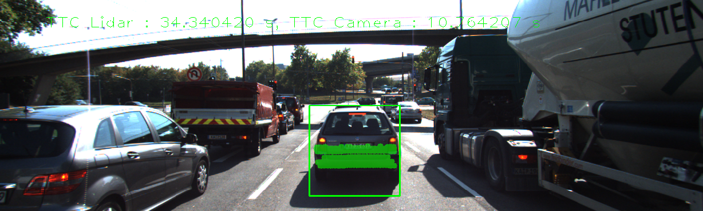

# SFND 3D Object Tracking

Welcome to the final project of the camera course. By completing all the lessons, you now have a solid understanding of keypoint detectors, descriptors, and methods to match them between successive images. Also, you know how to detect objects in an image using the YOLO deep-learning framework. And finally, you know how to associate regions in a camera image with Lidar points in 3D space. Let's take a look at our program schematic to see what we already have accomplished and what's still missing.


In this final project, you will implement the missing parts in the schematic. To do this, you will complete four major tasks: 
1. First, you will develop a way to match 3D objects over time by using keypoint correspondences. 
2. Second, you will compute the TTC based on Lidar measurements. 
3. You will then proceed to do the same using the camera, which requires to first associate keypoint matches to regions of interest and then to compute the TTC based on those matches. 
4. And lastly, you will conduct various tests with the framework. Your goal is to identify the most suitable detector/descriptor combination for TTC estimation and also to search for problems that can lead to faulty measurements by the camera or Lidar sensor. In the last course of this Nanodegree, you will learn about the Kalman filter, which is a great way to combine the two independent TTC measurements into an improved version which is much more reliable than a single sensor alone can be. But before we think about such things, let us focus on your final project in the camera course. 

## Dependencies for Running Locally
* cmake >= 2.8
  * All OSes: [click here for installation instructions](https://cmake.org/install/)
* make >= 4.1 (Linux, Mac), 3.81 (Windows)
  * Linux: make is installed by default on most Linux distros
  * Mac: [install Xcode command line tools to get make](https://developer.apple.com/xcode/features/)
  * Windows: [Click here for installation instructions](http://gnuwin32.sourceforge.net/packages/make.htm)
* OpenCV >= 4.1
  * This must be compiled from source using the `-D OPENCV_ENABLE_NONFREE=ON` cmake flag for testing the SIFT and SURF detectors.
  * The OpenCV 4.1.0 source code can be found [here](https://github.com/opencv/opencv/tree/4.1.0)
* gcc/g++ >= 5.4
  * Linux: gcc / g++ is installed by default on most Linux distros
  * Mac: same deal as make - [install Xcode command line tools](https://developer.apple.com/xcode/features/)
  * Windows: recommend using [MinGW](http://www.mingw.org/)

## Basic Build Instructions

1. Clone this repo.
2. Make a build directory in the top level project directory: `mkdir build && cd build`
3. Compile: `cmake .. && make`
4. Run it: `./3D_object_tracking`.

# SFND 3D Object Tracking
## [Rubric](https://review.udacity.com/#!/rubrics/2550/view) Points
---
#### 1. Match 3D Objects

Implement the method "matchBoundingBoxes", which takes as input both the previous and the current data frames and provides as output the ids of the matched regions of interest (i.e. the boxID property). Matches must be the ones with the highest number of keypoint correspondences.

```c++
void matchBoundingBoxes(std::vector<cv::DMatch> &matches, std::map<int, int> &bbBestMatches, DataFrame &prevFrame, DataFrame &currFrame)
{
  	std::multimap<int, int> Keypoint_BoxID;
    int maxPrevBoxID = 0;
  
  	//// Search for the box ID for each matched keypoint in both previous and current frame
    for (auto it1=matches.begin(); it1<matches.end(); ++it1)
    {
      //Locate the keypoints for each pair of match
      cv::KeyPoint Prev_Keypoint = prevFrame.keypoints[it1->queryIdx];
      cv::KeyPoint Curr_Keypoint = currFrame.keypoints[it1->trainIdx];
      
      //Initianize the BoxID 
      int Prev_BoxID;
      int Curr_BoxID;   
      bool Prev_Find = false;
      bool Curr_Find = false;
      
      //Find the BoxID of the keypoint from previous frame
      for (auto it2=prevFrame.boundingBoxes.begin(); it2<prevFrame.boundingBoxes.end(); ++it2)
      {
      	if (it2->roi.contains(Prev_Keypoint.pt))
        {
          Prev_BoxID = it2->boxID;
          Prev_Find = true;
          break;
        }
      }
            
      //Find the BoxID of the keypoint from current frame
      for (auto it3=currFrame.boundingBoxes.begin(); it3<currFrame.boundingBoxes.end(); ++it3)
      {
      	if (it3->roi.contains(Curr_Keypoint.pt))
        {
          Curr_BoxID = it3->boxID;
          Curr_Find = true;
          break;
        }
      }
      
      if (Prev_Find && Curr_Find)
      {
        maxPrevBoxID = std::max(maxPrevBoxID, Prev_BoxID);      
      	Keypoint_BoxID.insert({Curr_BoxID, Prev_BoxID});
      }
      else{
        continue;
      }
    }
       
    //// Loop through each boxID in the current frame, and get the mode (most frequent value) of associated boxID for the previous frame
    for (auto itr = currFrame.boundingBoxes.begin(); itr < currFrame.boundingBoxes.end(); ++itr)
    {
      int curr_ID = itr->boxID;
      std::multimap<int,int>::iterator itr1;   //create a multimap iterator
      std::vector<int> count (maxPrevBoxID+1, 0);    //create a vertor will all of the elements being 0. The length of this vector is the max ID number of previous bounding boxes.
      
      // Accumulator loop
      for (itr1=Keypoint_BoxID.equal_range(curr_ID).first; itr1 != Keypoint_BoxID.equal_range(curr_ID).second; ++itr1)
      {
        count[(*itr1).second] += 1;
      }
      
      // Get the index of the maximum count (the mode) of the previous frame's boxID
      int modeIndex = std::distance(count.begin(), std::max_element(count.begin(), count.end()));
      bbBestMatches.insert({modeIndex, curr_ID});   
    }           
}
```

#### 2. Compute Lidar-based TTC

Compute the time-to-collision in second for all matched 3D objects using only Lidar measurements from the matched bounding boxes between current and previous frame.

```c++
void computeTTCLidar(std::vector<LidarPoint> &lidarPointsPrev,
                     std::vector<LidarPoint> &lidarPointsCurr, double frameRate, double &TTC)
{
    // auxiliary variables
    double dT = 1/frameRate;        // time between two measurements in seconds
    double laneWidth = 4.0; // assumed width of the ego lane

    // find closest distance to Lidar points within ego lane
    double minXPrev = 1e9, minXCurr = 1e9;
    for (auto it = lidarPointsPrev.begin(); it != lidarPointsPrev.end(); ++it)
    {
      	if (it->y > (-laneWidth/2) && it->y < (laneWidth/2)){
          minXPrev = minXPrev > it->x ? it->x : minXPrev;
        }
      	else{
          continue;
        }
    }

    for (auto it = lidarPointsCurr.begin(); it != lidarPointsCurr.end(); ++it)
    {
      if (it->y > (-laneWidth/2) && it->y < (laneWidth/2)){
          minXCurr = minXCurr > it->x ? it->x : minXCurr;
        }
      	else{
          continue;
        }  
      
    }

    // compute TTC from both measurements
    TTC = minXCurr * dT / (minXPrev - minXCurr);
}
```

#### 3. Associate Keypoint Correspondences with Bounding Boxes

Prepare the TTC computation based on camera measurements by associating keypoint correspondences to the bounding boxes which enclose them. All matches which satisfy this condition must be added to a vector in the respective bounding box.

```c++
void clusterKptMatchesWithROI(BoundingBox &boundingBox, std::vector<cv::KeyPoint> &kptsPrev, std::vector<cv::KeyPoint> &kptsCurr, std::vector<cv::DMatch> &kptMatches)
{
  	std::vector<cv::DMatch> kptMatches_ROI;
    //if the keypoint is within the bounding box, then insert it into ROI vector "kptMatches_ROI"
    for (auto it1=kptMatches.begin(); it1<kptMatches.end(); ++it1)
    {
      if (boundingBox.roi.contains(kptsCurr[it1->trainIdx].pt))
      {
        kptMatches_ROI.push_back(*it1);
      }
    }

  	//compute a robust mean of all the euclidean distances between keypoint matches 
  	double dis_sum = 0;
  	for (auto it2=kptMatches_ROI.begin(); it2<kptMatches_ROI.end(); ++it2)
    {
      //double distance = cv::norm(kptsCurr[it2->trainIdx].pt - kptsPrev[it2->queryIdx].pt);
      //dis_sum = dis_sum + distance;
      dis_sum = dis_sum + it2->distance;
    }
    double dis_mean = dis_sum / kptMatches_ROI.size();    //calculate the mean distance of all of the matches.
  	
  
  	//then remove those that are too far away from the mean.
  	for (auto it3=kptMatches_ROI.begin(); it3<kptMatches_ROI.end(); ++it3)
    {
      //double distance = cv::norm(kptsCurr[it3->trainIdx].pt - kptsPrev[it3->queryIdx].pt);
      if ((it3->distance > dis_mean*0.7) && (it3->distance < dis_mean*1.3))
      {
        boundingBox.kptMatches.push_back(*it3);
      }
    }
}

```

#### 4. Compute Camera-based TTC

Compute the time-to-collision in second for all matched 3D objects using only keypoint correspondences from the matched bounding boxes between current and previous frame.

```c++
void computeTTCCamera(std::vector<cv::KeyPoint> &kptsPrev, std::vector<cv::KeyPoint> &kptsCurr, 
                      std::vector<cv::DMatch> kptMatches, double frameRate, double &TTC, cv::Mat *visImg)
{
    // compute distance ratios between all matched keypoints
    vector<double> distRatios; // stores the distance ratios for all keypoints between curr. and prev. frame
    for (auto it1 = kptMatches.begin(); it1 != kptMatches.end() - 1; ++it1)
    { // outer kpt. loop

        // get current keypoint and its matched partner in the prev. frame
        cv::KeyPoint kpOuterCurr = kptsCurr.at(it1->trainIdx);
        cv::KeyPoint kpOuterPrev = kptsPrev.at(it1->queryIdx);

        for (auto it2 = kptMatches.begin() + 1; it2 != kptMatches.end(); ++it2)
        { // inner kpt.-loop

            double minDist = 100.0; // min. required distance

            // get next keypoint and its matched partner in the prev. frame
            cv::KeyPoint kpInnerCurr = kptsCurr.at(it2->trainIdx);
            cv::KeyPoint kpInnerPrev = kptsPrev.at(it2->queryIdx);

            // compute distances and distance ratios
            double distCurr = cv::norm(kpOuterCurr.pt - kpInnerCurr.pt);
            double distPrev = cv::norm(kpOuterPrev.pt - kpInnerPrev.pt);

            if (distPrev > std::numeric_limits<double>::epsilon() && distCurr >= minDist)
            { // avoid division by zero

                double distRatio = distCurr / distPrev;
                distRatios.push_back(distRatio);
            }
         
        } // eof inner loop over all matched kpts
    }     // eof outer loop over all matched kpts

    // only continue if list of distance ratios is not empty
    if (distRatios.size() == 0)
    {
        TTC = NAN;
        return;
    }

  	std::sort(distRatios.begin(), distRatios.end());
    long medIndex = floor(distRatios.size() / 2.0);
    double medDistRatio = distRatios.size() % 2 == 0 ? (distRatios[medIndex - 1] + distRatios[medIndex]) / 2.0 : distRatios[medIndex]; // compute median dist. ratio to remove outlier influence

    double dT = 1 / frameRate;
    TTC = -dT / (1 - medDistRatio);
} 
```

#### 5.  Performance Evaluation 1

Find examples where the TTC estimate of the Lidar sensor does not seem plausible. Describe your observations and provide a sound argumentation why you think this happened.

Some examples with wrong TTC estimate of the Lidar sensor:

IMAGE               | Description
--------------------| -------------------
 | TTC from Lidar is not correct because of TTC is too big compared with last frame. Need to put a filter to rationalize the calculated TTC value based on previous results from previous frames.
 | TTC from Lidar is negative because estimation uses mean of all Lidar points that return minXCurr > minXPrev. Need to delete Lidar points from preceding vehicle front mirrors.
 | TTC from Lidar is too small because of the outliners in between preceding vehicle and the autonomous vehicle.Need to put a filter to identify and filter them out.


#### 6. Performance Evaluation 2

Run several detector / descriptor combinations and look at the differences in TTC estimation. Find out which methods perform best and also include several examples where camera-based TTC estimation is way off. As with Lidar, describe your observations again and also look into potential reasons.

Some examples with wrong TTC estimate of the Camera:

IMAGE               | Description
--------------------| -------------------
 | TTC from Camera is very small because medDistRatio is too big, which potentially caused by the median value with the big value of outliner.
 | TTC from Camera is very big because medDistRatio is too small, which potentially caused by the median value with small value of outliner.
 | TTC from Camera is negative infinity because medDistRatio == 1. Need to check medDistRatio to avoid division by zero.

I created a loop in code to test all possible combinations of detectors and descriptors and saved the results in a [Excel file](/Result/Camera_TTC.csv).

Here is a plot as reference: 


The TOP3 detector / descriptor combinations as the best choice for our purpose of detecting keypoints on vehicles are:
SHITOMASI/BRISK      
SHITOMASI/BRIEF            
SHITOMASI/ORB